# ii-noob-ctf

## Infosec Institute n00b CTF

For fun and enlightenment, I wrote up my answers to the [Infosec Institute n00b CTF](http://ctf.infosecinstitute.com/index.php) challenges. In cases where I got stuck on a question after trying for a long time, I used solutions from [The Secure Ninja blog](http://blog.thesecure.ninja) to help me finish the level.

## Contents
- [Level 1](#level-1)
- [Level 2](#level-2)
- [Level 3](#level-3)
- [Level 4](#level-4)
- [Level 5](#level-5)
- [Level 6](#level-6)
- [Level 7](#level-7)
- [Level 8](#level-8)
- [Level 9](#level-9)
- [Level 10](#level-10)
- [Level 11](#level-11)
- [Level 12](#level-12)
- [Level 13](#level-13)
- [Level 14](#level-14)

### Level 1


Sounds like a hint, let’s look at the page source. 

Right click + “Inspect”

Sources -> levelone.php

CMD+F for “flag”

Right at the top of the source file: `<!-- infosec_flagis_welcome -->`

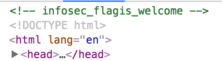

Note: at first glance I thought this was going to be some complicated steganography thing. Forgot this was a “beginner” challenge :) 

Level 1 flag: `welcome`

### Level 2

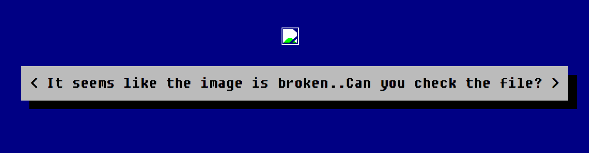

Tried to copy the base64 URI of the file, but there was none (it came out as `data:image/jpeg;base64,`).

Downloaded the file and ran `$ strings -a leveltwo.jpeg`. I did this because I'd seen it before, but didn't really know how it worked. Learned that `strings` looks for ASCII strings in a binary file; the `-a` flag tells it to also look in the `__TEXT,__text` section, which it does not search by default. I don't know why that's the case.
```
$ strings -a leveltwo.jpeg
> aW5mb3NlY19mbGFnaXNfd2VhcmVqdXN0c3RhcnRpbmc=
```

Oh hey, that looks vaguely like a base64-encoded thing. 

Then you just base64 decode it, which you can do on the command line by piping the output of `strings` to the `base64` command:
```
$ strings -a leveltwo.jpg | base64 -D
> infosec_flagis_wearejuststarting
```

Level 2 flag: `wearejuststarting`

### Level 3

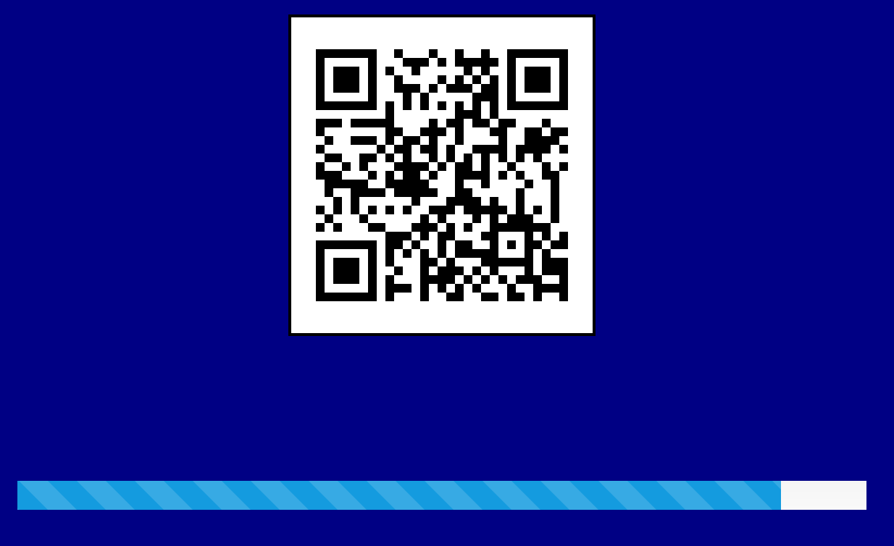

Set the progress bar to 100% in Chrome dev tools because it felt right.

Put the QR code into [an online decoder](https://zxing.org/w/decode) and got `.. -. ..-. --- ... . -.-. ..-. .-.. .- --. .. ... -- --- .-. ... .. -. --.` as a result. That looks like Morse code!

Put it into a [Morse code decoder](http://morsecode.scphillips.com/translator.html) which returned `INFOSECFLAGISMORSING`.

Level 3 flag: `MORSING`

### Level 4


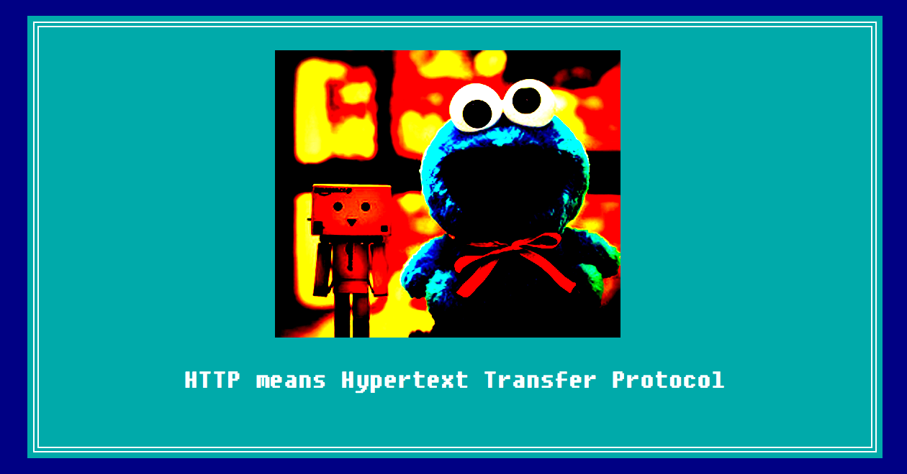

The first thing you have to do is disable alerts from the page because this won't stop popping up:

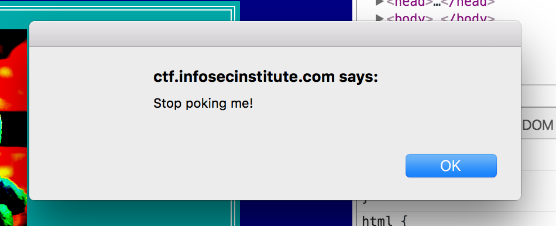

The cookie monster is a big hint. Let’s look at the Network tab to see if we can find an out-of-the-ordinary cookie.

Bingo: on the request for `http://ctf.infosecinstitute.com/img/thumb.jpg`, there is a request header called “Cookie” with the value `fusrodah=vasbfrp_syntvf_jrybirpbbxvrf`

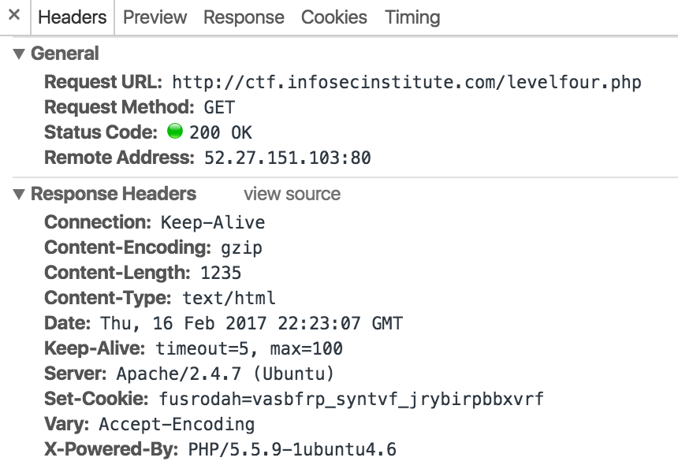

Based on my limited experience, that looks like it could be a Caesar cipher.

Put it into [this Caesar cipher cracker](https://www.nayuki.io/page/automatic-caesar-cipher-breaker-javascript) and got a shift of 13, which yielded: `shfebqnu=infosec_flagis_welovecookies`

Level 4 flag: `welovecookies`

### Level 5

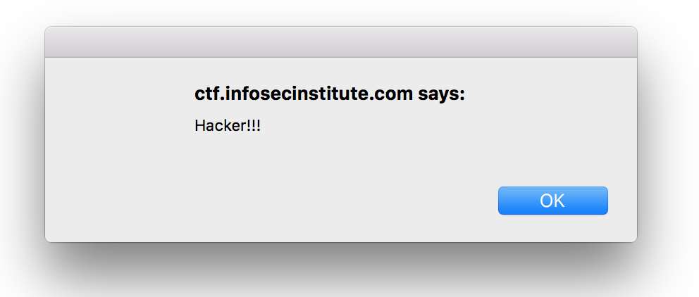

Just constantly puts up an alert that says “Hacker!!!”, preventing the page from loading. Even the "disable alerts" checkbox didn't help, so I had to disable JavaScript for that page. 

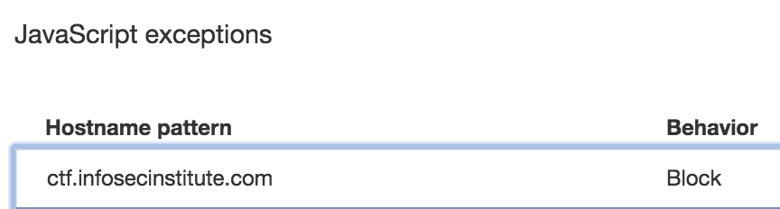

This revealed an image, but nothing else.


Ironically I'd forgotten about steganography, my go-to assumption for level 1, and had to Google for a hint.

I put the image into a [steganography decoder online](https://futureboy.us/stegano/decinput.html), yielding the following binary: 

```
01101001011011100110011001101111011100110110010101100011010111110110011001101100011000010110011101101001011100110101111101110011011101000110010101100111011000010110110001101001011001010110111001110011
```

I put this into a binary to ASCII decoder, which gave me `infosec_flagis_stegaliens`

Level 5 flag: `stegaliens`

### Level 6

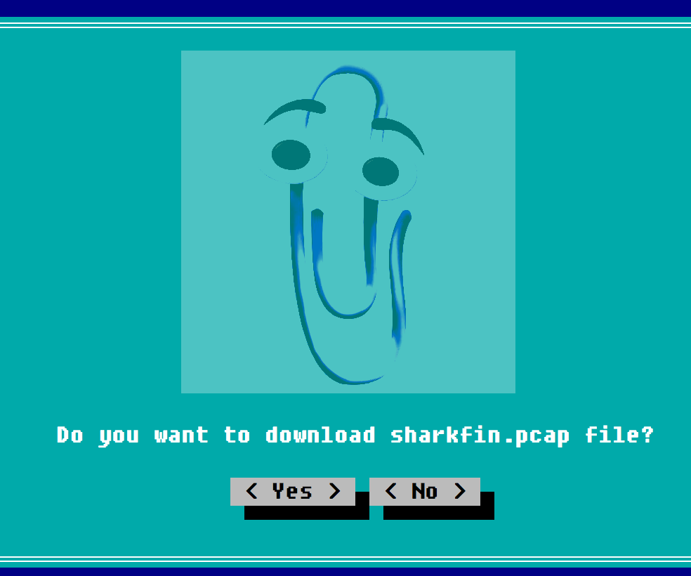

Downloaded the .pcap file after determining there was no alternative (the "no" button didn't do anything). Poked around the file in [WireShark](https://www.wireshark.org/) for a long time, but to no avail. 

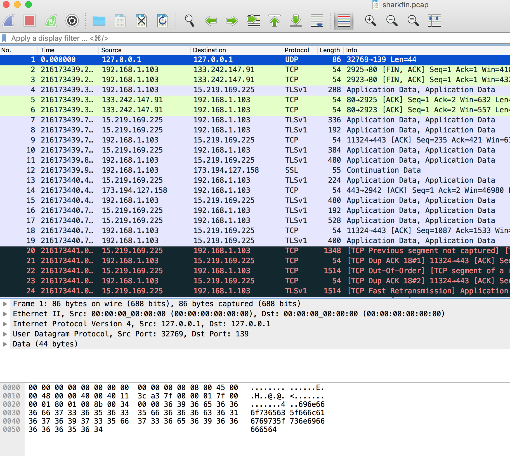

Googled a hint, and learned that it’s unusual to see 127.0.0.1 (the local host) in a .pcap file... I guess that makes sense. The very first packet was the only one with that IP, so I clicked on it and did a “follow UDP”:

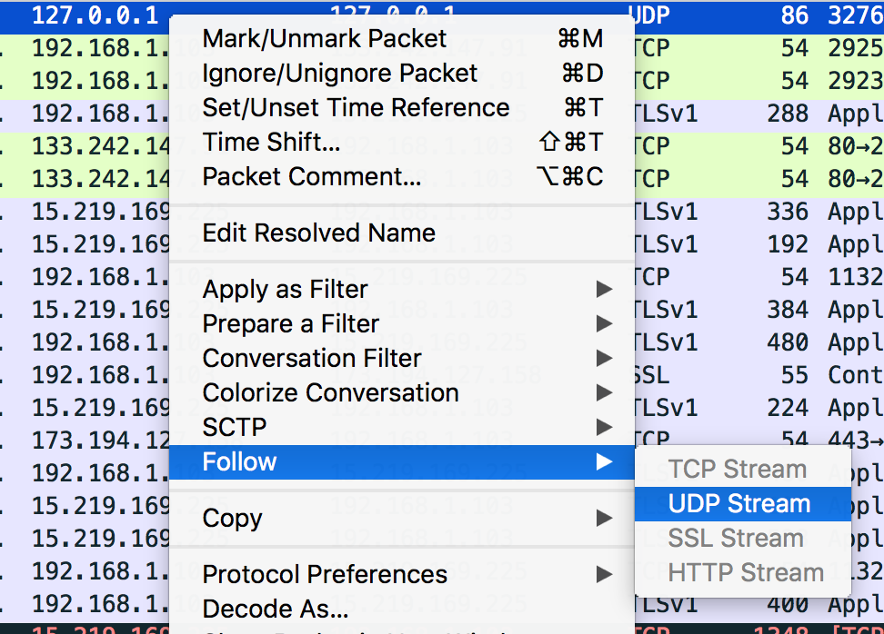 Follow UDP">

This opened a new window that just had a hex string. I put it in a hex to ASCII converter and got `infosec_flagis_sniffed`. 

Level 6 flag: `sniffed`

### Level 7

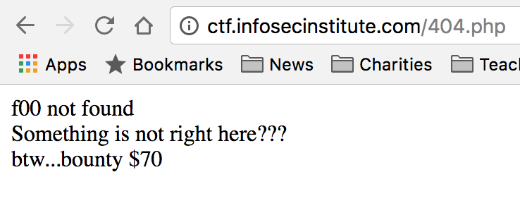

When inspecting the page in previous levels, I'd noticed that this dropdown menu link was broken.

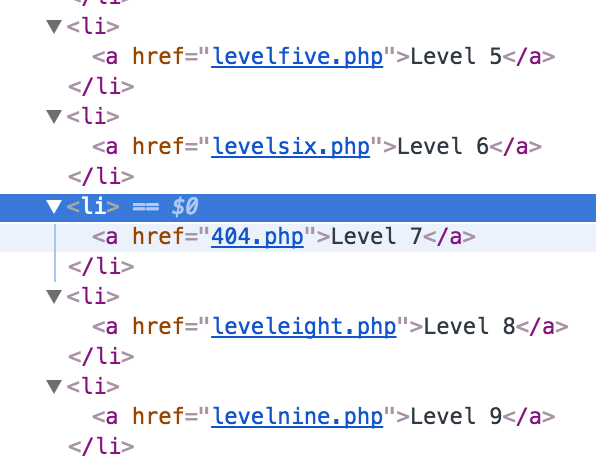

So I typed in the same pattern of URL that all the other ones had. It was blank, but in the response (200) there was a base64 string (`aW5mb3NlY19mbGFnaXNfeW91Zm91bmRpdA==`). 

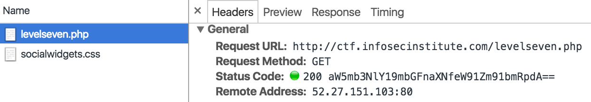

```
$ echo 'aW5mb3NlY19mbGFnaXNfeW91Zm91bmRpdA==' | base64 -D 
$ infosec_flagis_youfoundit
```

Level 7 flag: `youfoundit`

### Level 8

### Level 9

### Level 10

### Level 11

### Level 12

### Level 13

### Level 14

